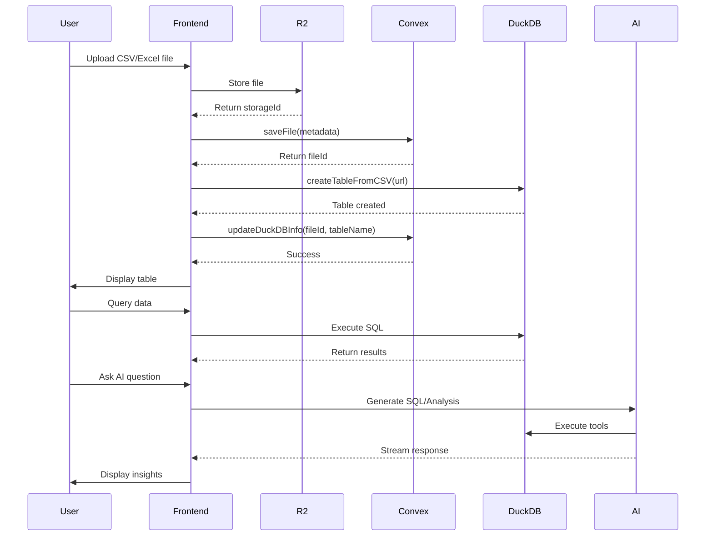

## Overview

Meridian's data flow is designed for **performance, real-time collaboration, and AI-powered insights**. Data flows through multiple layers, each optimized for specific operations.

## Complete Data Flow Diagram



## 1. File Upload Flow

### Step-by-Step Process

<Steps>
  <Step title="User Selects File">
    User drags and drops or selects a CSV/Excel file in the dashboard.
    
    **Component:** `src/components/dashboard/FileUpload.tsx`
    
    **Supported Formats:**
    - CSV (.csv)
    - Excel (.xlsx, .xls)
    - JSON (.json)
  </Step>
  
  <Step title="Upload to Cloudflare R2">
    File is uploaded directly to R2 object storage.
    
    ```typescript
    // Generate signed upload URL
    const uploadUrl = await generateUploadUrl()
    
    // Upload file to R2
    const response = await fetch(uploadUrl, {
      method: 'POST',
      body: file,
    })
    
    const { storageId } = await response.json()
    ```
    
    **File:** `convex/r2.ts:7`
  </Step>
  
  <Step title="Save Metadata to Convex">
    File metadata is stored in Convex database.
    
    ```typescript
    const fileId = await saveFile({
      storageId,
      fileName: file.name,
      fileType: file.type,
      fileSize: file.size,
    })
    ```
    
    **Schema:** `convex/schema.ts:14-23`
    
    ```typescript
    files: defineTable({
      storageId: v.string(),
      fileName: v.string(),
      fileType: v.string(),
      fileSize: v.number(),
      uploadedBy: v.string(),
      uploadedAt: v.number(),
      duckdbTableName: v.optional(v.string()),
      duckdbProcessed: v.optional(v.boolean()),
    }).index('by_uploadedBy', ['uploadedBy'])
    ```
  </Step>
  
  <Step title="Process File into DuckDB">
    File is loaded into DuckDB for analytical queries.
    
    ```typescript
    // Get file URL from R2
    const url = await getFileUrl({ storageId })
    
    // Create DuckDB table
    const result = await createTableFromCSV({
      csvUrl: url,
      tableName: fileName.replace(/\.(csv|xlsx|xls)$/, ''),
    })
    ```
    
    **File:** `src/utils/duckdb.ts:80-148`
    
    **DuckDB Process:**
    1. Fetch CSV from R2 URL
    2. Save to temporary file
    3. Use `read_csv_auto()` to infer schema
    4. Create table with inferred types
    5. Clean up temporary file
  </Step>
  
  <Step title="Update File Status">
    Mark file as processed in Convex.
    
    ```typescript
    await updateDuckDBInfo({
      fileId,
      tableName: sanitizedTableName,
    })
    ```
    
    **File:** `convex/csv.ts:111-134`
  </Step>
  
  <Step title="User Sees Data">
    Frontend automatically updates via Convex subscription.
    
    ```typescript
    // Real-time subscription
    const { data: files } = useQuery(convexQuery(api.csv.getFiles, {}))
    ```
    
    File appears in dashboard with "Processed" badge.
  </Step>
</Steps>

### Upload Flow Code References

```typescript
// Client-side upload flow
// File: src/components/dashboard/FileUpload.tsx

1. User drops file → Mantine Dropzone
2. Get upload URL → convex/r2.ts:7 (generateUploadUrl)
3. Upload to R2 → fetch(uploadUrl, { body: file })
4. Save metadata → convex/csv.ts:10 (saveFile mutation)
5. Process file → src/utils/duckdb.ts:80 (createTableFromCSV)
6. Update status → convex/csv.ts:111 (updateDuckDBInfo mutation)
```

## 2. Query Execution Flow

### SQL Query Path

<CodeGroup>

```typescript User Query
// User types SQL in QueryEditor
const [query, setQuery] = useState('SELECT * FROM table')

// User clicks Execute
await handleExecuteQuery()
```

```typescript Server Function
// Query executed via TanStack Start server function
const result = await queryDuckDB({ data: query })

// File: src/utils/duckdb.ts:32-78
export const queryDuckDB = createServerFn()
  .handler(async ({ data: query }) => {
    const db = await getDuckDB()
    const connection = await db.connect()
    const result = await connection.run(query)
    
    // Extract columns and rows
    const columns = Array.from({ length: result.columnCount }, (_, i) => ({
      name: result.columnName(i),
      type: String(result.columnType(i)),
    }))
    
    const rows = await result.getRows()
    return JSON.stringify({ columns, rows })
  })
```

```typescript Query Logging
// Log query to Convex for history
await logQuery({
  query,
  tableName,
  success: true,
  resultMetadata: {
    rowCount: rows.length,
    columnCount: columns.length,
    executionTimeMs: elapsed,
  },
})

// File: convex/queryLog.ts
```

```typescript Broadcast Notification
// Notify other users
await broadcastNotification({
  tableName,
  type: 'query',
  message: `executed a query: ${queryPreview}`,
})

// File: convex/notifications.ts
```

</CodeGroup>

### Query Execution Sequence

```
┌─────────────────────────────────────────────────────────────┐
│  1. User Input                                              │
│  QueryEditor component (src/components/QueryEditor.tsx)     │
└──────────────────┬──────────────────────────────────────────┘
                   ↓
┌─────────────────────────────────────────────────────────────┐
│  2. Client Handler                                          │
│  handleExecuteQuery() in table.$table.tsx:449              │
│  - Validate query                                           │
│  - Start loading state                                      │
└──────────────────┬──────────────────────────────────────────┘
                   ↓
┌─────────────────────────────────────────────────────────────┐
│  3. Server Function                                         │
│  queryDuckDB() via TanStack Start                           │
│  - Routes to /api/duckdb/query endpoint                    │
└──────────────────┬──────────────────────────────────────────┘
                   ↓
┌─────────────────────────────────────────────────────────────┐
│  4. DuckDB Execution                                        │
│  src/utils/duckdb.ts:32                                     │
│  - Get DuckDB instance                                      │
│  - Execute SQL query                                        │
│  - Parse results                                            │
└──────────────────┬──────────────────────────────────────────┘
                   ↓
┌─────────────────────────────────────────────────────────────┐
│  5. Parallel Operations                                     │
│  ├─ Log query → Convex (convex/queryLog.ts)               │
│  ├─ Broadcast notification → Convex                        │
│  └─ Generate statistics → analyzeTableWithDuckDB()         │
└──────────────────┬──────────────────────────────────────────┘
                   ↓
┌─────────────────────────────────────────────────────────────┐
│  6. UI Update                                               │
│  - Invalidate TanStack Query cache                          │
│  - Re-render table with new data                            │
│  - Update statistics panel                                  │
│  - Show success notification                                │
└─────────────────────────────────────────────────────────────┘
```

## 3. AI Agent Flow

### Natural Language to SQL

<Steps>
  <Step title="User Asks Question">
    User types natural language in the Agent panel.
    
    ```typescript
    // Component: src/components/AgentEditor.tsx
    const [agentInput, setAgentInput] = useState('')
    // User types: "Show me top 10 customers by revenue"
    ```
  </Step>
  
  <Step title="Context Preparation">
    Frontend gathers table context.
    
    ```typescript
    const response = await askGemini({
      prompt: agentInput,
      tableName: table,
      columns: data.columns,
      sampleRows: data.rows.slice(0, 3),
      mode: 'query', // or 'analysis'
    })
    ```
    
    **File:** `convex/table_agent.ts:496`
  </Step>
  
  <Step title="AI Generates SQL">
    Gemini generates DuckDB SQL queries.
    
    ```typescript
    // Agent constructs contextual prompt
    const contextualPrompt = `
    TABLE CONTEXT:
    - Table Name: ${tableName}
    - Columns: ${describeColumns(columns)}
    - Sample data: ${JSON.stringify(sampleRows)}
    
    USER REQUEST:
    ${prompt}
    
    Please write DuckDB SQL queries.
    `
    
    // Stream structured response
    const response = await agent.streamObject(ctx, thread, {
      prompt: contextualPrompt,
      schema: z.object({
        commands: z.array(z.string()).min(1).max(10),
        description: z.string(),
      }),
    })
    ```
    
    **File:** `convex/table_agent.ts:610-711`
  </Step>
  
  <Step title="Execute Generated Queries">
    Queries are queued and executed sequentially.
    
    ```typescript
    // Set up command queue
    setCommandQueue(response.commands)
    setCurrentCommandIndex(0)
    setQuery(response.commands[0])
    
    // User clicks Execute to run each query
    ```
    
    **File:** `src/routes/_authed/table.$table.tsx:73-75`
  </Step>
  
  <Step title="Store Conversation">
    Agent messages are persisted for history.
    
    ```typescript
    // Create or update thread
    await ctx.runMutation(api.agent_utils.insertAgentMessageRecord, {
      threadId: thread._id,
      role: 'user',
      content: prompt,
    })
    
    await ctx.runMutation(api.agent_utils.insertAgentMessageRecord, {
      threadId: thread._id,
      role: 'assistant',
      content: description,
      commands: commands,
    })
    ```
    
    **Schema:** `convex/schema.ts:63-102`
  </Step>
</Steps>

### Analysis Mode with Tools

When in **analysis mode**, the agent uses tools to explore data:

```typescript
// Define available tools
const analysis_agent = new Agent(components.agent, {
  name: 'analysis_agent',
  languageModel: model,
  tools: {
    queryDuckDB,        // Execute SQL
    getTableSchema,     // Get columns
    getSampleRows,      // Get sample data
    createChart,        // Generate visualization
    generateInsights,   // Analyze patterns
    firecrawlSearch,    // Search web
    scrapeWebPage,      // Get web content
    analyzeDataQuality, // Quality checks
  },
})

// Agent decides which tools to use
const response = await agent.streamText(ctx, thread, {
  prompt: contextualPrompt,
})
```

**Tool Execution Flow:**

```
User asks: "What are the data quality issues?"
           ↓
Agent calls: analyzeDataQuality({ tableName })
           ↓
Tool executes: Multiple SQL queries to check:
  - Null percentages
  - Duplicate values
  - Empty strings
  - Data type consistency
           ↓
Tool returns: {
  issues: [...],
  qualityScore: 85,
}
           ↓
Agent synthesizes: "Found 3 issues:
  1. 15% null values in email column
  2. Duplicate IDs in user_id
  3. Empty strings in address field"
```

## 4. Insights Generation Flow

### Statistical Analysis Pipeline

<Tabs>
  <Tab title="1. Trigger">
    User clicks "Generate Insights" button.
    
    ```typescript
    const handleGenerateInsights = async () => {
      await generateInsightsForData(data, false)
    }
    ```
    
    **File:** `src/routes/_authed/table.$table.tsx:620`
  </Tab>
  
  <Tab title="2. DuckDB Analysis">
    Statistical queries executed in DuckDB.
    
    ```typescript
    // File: src/utils/duckdbAnalytics.ts
    const analyses = await analyzeTableWithDuckDB(
      tableName,
      query,
      columns
    )
    
    // Runs queries for:
    // - Basic statistics (count, mean, median, stddev)
    // - Distribution analysis
    // - Correlation analysis
    // - Outlier detection
    // - Trend analysis
    ```
  </Tab>
  
  <Tab title="3. AI Interpretation">
    Gemini interprets statistical findings.
    
    ```typescript
    // File: convex/insights.ts
    const result = await generateInsights({
      tableName,
      query,
      statisticalAnalyses: analyses,
      rowCount: data.rows.length,
      columnCount: data.columns.length,
    })
    ```
    
    **AI Prompt:**
    ```
    Analyze these statistical findings:
    ${JSON.stringify(analyses)}
    
    Generate actionable insights focusing on:
    - Anomalies and outliers
    - Trends and patterns
    - Data quality issues
    - Business recommendations
    ```
  </Tab>
  
  <Tab title="4. Cache Results">
    Insights cached to avoid regeneration.
    
    ```typescript
    // Schema: convex/schema.ts:24-42
    insightsCache: defineTable({
      cacheKey: v.string(),
      tableName: v.string(),
      query: v.string(),
      insights: v.array(v.object({
        title: v.string(),
        description: v.string(),
        type: v.string(),
        severity: v.string(),
      })),
      statisticalFindings: v.any(),
    }).index('by_cacheKey', ['cacheKey'])
    ```
  </Tab>
  
  <Tab title="5. Display">
    Insights shown in sidebar panel.
    
    ```typescript
    // Component: src/components/InsightsPanel.tsx
    <InsightsPanel
      insights={insights}
      onRefresh={handleRefreshInsights}
      onDismiss={handleDismissInsights}
    />
    ```
  </Tab>
</Tabs>

## 5. Real-time Collaboration Flow

### Presence & Notifications

Meridian supports real-time collaboration through Convex subscriptions.

```typescript
// Subscribe to notifications for a table
const notifications = useQuery(
  api.notifications.getNotifications,
  { tableName, limit: 20 }
)

// Component: src/components/TableNotifications.tsx:1
```

### Notification Types

<CardGroup cols={2}>
  <Card title="Query Execution" icon="database">
    When a user executes a SQL query
    
    ```typescript
    type: 'query',
    message: 'executed a query: SELECT...'
    ```
  </Card>
  
  <Card title="AI Agent Query" icon="robot">
    When AI generates SQL
    
    ```typescript
    type: 'agent_query',
    message: 'asked AI to generate query'
    ```
  </Card>
  
  <Card title="AI Analysis" icon="brain">
    When AI analyzes data
    
    ```typescript
    type: 'agent_analysis',
    message: 'asked AI for analysis'
    ```
  </Card>
  
  <Card title="Insights Generated" icon="lightbulb">
    When insights are created
    
    ```typescript
    type: 'insights_generated',
    message: 'generated 5 insights'
    ```
  </Card>
  
  <Card title="Chart Created" icon="chart-line">
    When visualization is generated
    
    ```typescript
    type: 'chart_created',
    message: 'created 2 charts'
    ```
  </Card>
</CardGroup>

### Real-time Update Flow

```
User A executes query
        ↓
Broadcast notification to Convex
        ↓
Convex triggers subscription update
        ↓
All clients subscribed to table receive notification
        ↓
User B sees: "User A executed a query: SELECT..."
        ↓
User B's data automatically refreshes
```

**Implementation:**

```typescript
// File: src/components/TableNotifications.tsx
const handleRemoteQueryExecuted = useCallback(() => {
  // Invalidate cache to refetch data
  queryClient.invalidateQueries({ queryKey: ['tables', table] })
  setPageIndex(0)
}, [queryClient, table])

// Listen for notifications
if (notification.type === 'query' && notification.userId !== currentUserId) {
  handleRemoteQueryExecuted()
}
```

## 6. Chart Generation Flow

### From AI Tool to Visualization

<Steps>
  <Step title="AI Calls createChart Tool">
    During analysis, agent decides to create visualization.
    
    ```typescript
    // File: convex/agent_tools.ts
    export const createChart = {
      description: 'Create a chart visualization',
      parameters: z.object({
        query: z.string(),
        chartType: z.enum(['line', 'bar', 'area', 'pie']),
        title: z.string(),
        xAxis: z.string(),
        yAxis: z.string(),
      }),
      execute: async (args) => {
        // Execute query
        // Analyze data structure
        // Return chart configuration
      }
    }
    ```
  </Step>
  
  <Step title="Tool Executes Query">
    Chart-specific SQL query runs.
    
    ```typescript
    const result = await ctx.runAction(
      api.table_agent.fetchDuckDBQuery,
      { query: args.query }
    )
    ```
  </Step>
  
  <Step title="Generate Chart Config">
    Tool returns Recharts configuration.
    
    ```typescript
    return {
      success: true,
      chart: {
        type: 'line',
        title: 'Revenue Over Time',
        data: chartData,
        xAxisKey: 'date',
        yAxisKey: 'revenue',
        series: [{ name: 'revenue', color: 'blue' }],
      }
    }
    ```
  </Step>
  
  <Step title="Extract from Tool Steps">
    Frontend extracts chart configs from agent messages.
    
    ```typescript
    // File: src/routes/_authed/table.$table.tsx:183-227
    const extractedCharts = useMemo(() => {
      const charts = []
      agentMessages.forEach((message) => {
        if (message.toolSteps) {
          message.toolSteps.forEach((step) => {
            if (step.tool === 'createChart' && step.result?.chart) {
              charts.push({
                id: `chart-${message.createdAt}-${stepIndex}`,
                config: step.result.chart,
                position: { x, y },
              })
            }
          })
        }
      })
      return charts
    }, [agentMessages])
    ```
  </Step>
  
  <Step title="Render Chart">
    Charts displayed in canvas.
    
    ```typescript
    // Component: src/components/ChartCanvas.tsx
    <ChartCanvas
      charts={charts}
      onRemoveChart={(id) => setCharts(prev => prev.filter(c => c.id !== id))}
      onChartMove={(id, position) => { /* update position */ }}
    />
    ```
  </Step>
  
  <Step title="Auto-refresh on Data Change">
    Charts re-execute queries when table data updates.
    
    ```typescript
    useEffect(() => {
      // Detect data changes
      const currentDataVersion = JSON.stringify({
        rowCount: data.rows.length,
        sampleHash: JSON.stringify(data.rows.slice(0, 3)),
      })
      
      // Re-execute all chart queries
      if (previousDataVersion !== currentDataVersion) {
        updateCharts()
      }
    }, [data])
    ```
    
    **File:** `src/routes/_authed/table.$table.tsx:283-447`
  </Step>
</Steps>

## Performance Optimizations

### Caching Strategy

<AccordionGroup>
  <Accordion title="TanStack Query Cache">
    Query results cached for 5 minutes.
    
    ```typescript
    queryClient.setQueryDefaults(['tables'], {
      staleTime: 5 * 60 * 1000,
      cacheTime: 10 * 60 * 1000,
    })
    ```
  </Accordion>
  
  <Accordion title="Insights Cache">
    AI-generated insights cached in Convex.
    
    ```typescript
    // Check cache before generating
    const cached = await ctx.db
      .query('insightsCache')
      .withIndex('by_cacheKey', (q) => q.eq('cacheKey', cacheKey))
      .first()
    ```
  </Accordion>
  
  <Accordion title="DuckDB Connection Pool">
    Single DuckDB instance reused across requests.
    
    ```typescript
    let duckDBInstance: DuckDBInstance | null = null
    
    export const getDuckDB = async () => {
      if (!duckDBInstance) {
        duckDBInstance = await DuckDBInstance.create(url)
      }
      return duckDBInstance
    }
    ```
  </Accordion>
</AccordionGroup>

### Streaming Optimizations

**AI Responses Stream Incrementally:**

```typescript
// Stream text responses
for await (const chunk of stream.fullStream) {
  if (chunk.type === 'text-delta') {
    assistantText += chunk.text
    // Update UI immediately
    await updateMessage({ content: assistantText })
  }
}
```

**Large Datasets Paginated:**

```typescript
const paginatedRows = useMemo(() => {
  const start = pageIndex * pageSize
  const end = start + pageSize
  return data.rows.slice(start, end)
}, [data.rows, pageIndex, pageSize])
```

## Error Handling

### Graceful Degradation

```typescript
try {
  const result = await queryDuckDB({ data: query })
  await logQuery({ query, success: true })
} catch (err) {
  // Log error
  await logQuery({ query, success: false, error: err.message })
  // Show user-friendly message
  setError('Query failed. Please check your SQL syntax.')
  // Don't crash the app
}
```

## Next Steps

<CardGroup cols={2}>
  <Card title="Architecture Overview" icon="building" href="/architecture/overview">
    Understand the overall system design
  </Card>
  <Card title="Tech Stack" icon="layer-group" href="/architecture/tech-stack">
    Explore detailed technology information
  </Card>
</CardGroup>